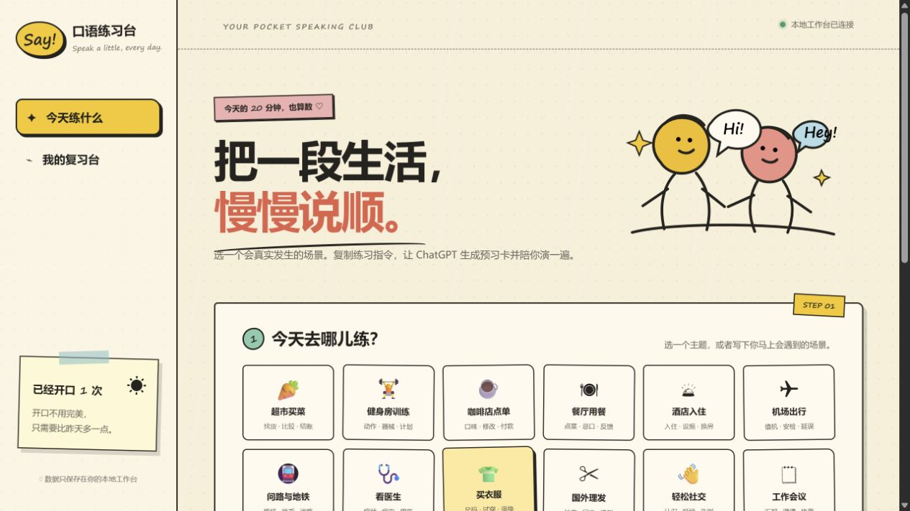
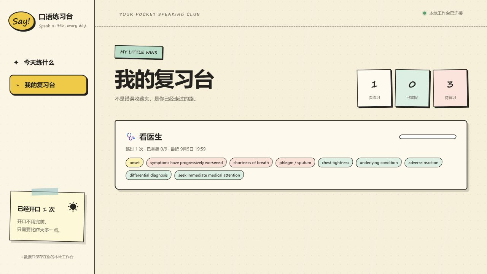

# 口语练习台（Kouyu）

一个面向 Codex / ChatGPT 的英语口语陪练 Skill：在对话里确定主题并完成场景化训练，过程中提供渐进式中文提示和轻量纠错，结束后自动整理真实表现、纠正和下一步，并保存到本地复习台。



## 能做什么

- 覆盖超市、健身房、咖啡店、餐厅、酒店、机场、理发、面试等真实场景，也支持自定义主题
- 提供 5、10、20、40 分钟四种训练节奏，以及入门、中级、进阶难度
- 提供沉浸式、引导式、学习式三种辅助模式；课程目标不变，只调整中文提示与句型支架出现的时机
- 先预习重点单词、实用词组和完整句型，再开始角色扮演；5 / 10 / 20 / 40 分钟分别提供 15 / 20 / 30 / 40 个场景词汇
- 按“中文意图提示 → 英文关键词 → 完整示范”逐级提供帮助
- 只纠正影响理解、重复出现或与本课目标直接相关的问题
- 区分独立使用、提示后使用和模仿使用，不会把“看过”误判成“掌握”
- 将训练结果归档为 JSON 和 Markdown，并提供本地可视化复习台
- 英语材料使用独立的 `english_kouyu` 来源范围，不会混入多语种示例课程



## 安装

需要 **Python 3.10+**（仅标准库，无需 pip / Node.js / API Key）、Git，以及能加载本地 Skill 并执行脚本的客户端。主题、时长和辅助方式都在对话中确定；网页只负责查看归档、纠正和复练安排，不会直接发起 AI 对话或语音通话。普通聊天页面不能仅通过输入 `$kouyu` 读取本机 Skill 和保存本地记录。

把仓库克隆到 Codex 的 Skills 目录：

```bash
git clone https://github.com/maverickgao8848/kouyu.git ~/.codex/skills/kouyu
```

重新打开 Codex 后即可使用。也可以把本仓库的完整目录复制到你所使用客户端的 Skills 目录中。

Windows PowerShell：

```powershell
git clone https://github.com/maverickgao8848/kouyu.git "$env:USERPROFILE/.codex/skills/kouyu"
```

如已安装，不要重复克隆；在安装目录运行 `git pull --ff-only` 更新。若配置了自定义 Skills 目录，请相应替换路径。

## 开始练习

直接说：

```text
使用 $kouyu 帮我做一次 20 分钟的英语口语训练。
主题：在国外理发
程度：中级
中文辅助：引导
```

Skill 会先生成预习卡。准备好后说 **“I'm ready.”** 开始角色扮演；想结束并查看报告时说 **“Let's wrap up.”**。

## 本地复习台

以下相对路径命令均在仓库根目录（包含 `SKILL.md` 的目录）执行。`serve` 会自动初始化空工作台，可以直接启动：

```bash
python scripts/workbench.py serve
```

Windows 安装后可从任意目录启动，并固定使用同一份数据：

```powershell
python "$env:USERPROFILE/.codex/skills/kouyu/scripts/workbench.py" serve
```

默认地址是 **http://127.0.0.1:8765/**。保持终端运行，按 `Ctrl+C` 停止。工作台不会再次要求选择主题；它只展示对话结束后自动归档的当前掌握度、原句与自然改法、下次重点和迁移练习，并会定时刷新。

默认数据目录固定为用户主目录下的 `english-speaking-workbench`，因此无论从哪个文件夹启动，归档与网页都会读取同一份历史。只有想更换存放位置时，才需要给 `archive` 和 `serve` 同时传入相同的 `--data-dir`。

### 归档与数据

初始化数据目录：

```bash
python scripts/workbench.py init
```

归档一次训练：

```bash
python scripts/workbench.py archive --input path/to/session.json
```

Session 格式见 [数据规范](references/workbench-data.md)。正常练习结束时 Skill 会根据本次对话直接执行归档，不需要学习者手工维护 JSON。数据只写入本机，不会上传到远端；备份时复制整个数据目录。

### 打不开时

- 找不到 `python`：先安装 Python 3.10+；Windows 也可把命令中的 `python` 换成 `py -3`。
- 8765 端口被占用：追加 `--port 8766`，打开终端输出的新地址。
- 浏览器没有自动弹出：手动打开终端输出的地址；也可用 `--no-open` 禁用自动打开。
- 显示“预览模式”：通过 Python 服务的 HTTP 地址访问，直接双击 HTML 不能连接归档。
- 看不到已有记录：如果使用过 `--data-dir`，确认启动与归档传入的是同一个绝对目录；未传时两者都会使用用户主目录下的默认目录。

## 项目结构

```text
.
├── SKILL.md                    # Skill 入口与行为约定
├── agents/openai.yaml          # 名称、简介与默认提示词
├── curriculum/                # 英语课程来源范围与登记信息
├── references/                # 课程设计、会话、报告和数据规范
├── scripts/workbench.py        # 本地归档与网页服务
└── assets/workbench/           # 复习台前端
```

## 隐私

口语训练记录默认保存在用户主目录下的 `english-speaking-workbench`。仓库不包含个人练习数据，提交前也请确认不要把自己的 session JSON 推送到公开仓库。
